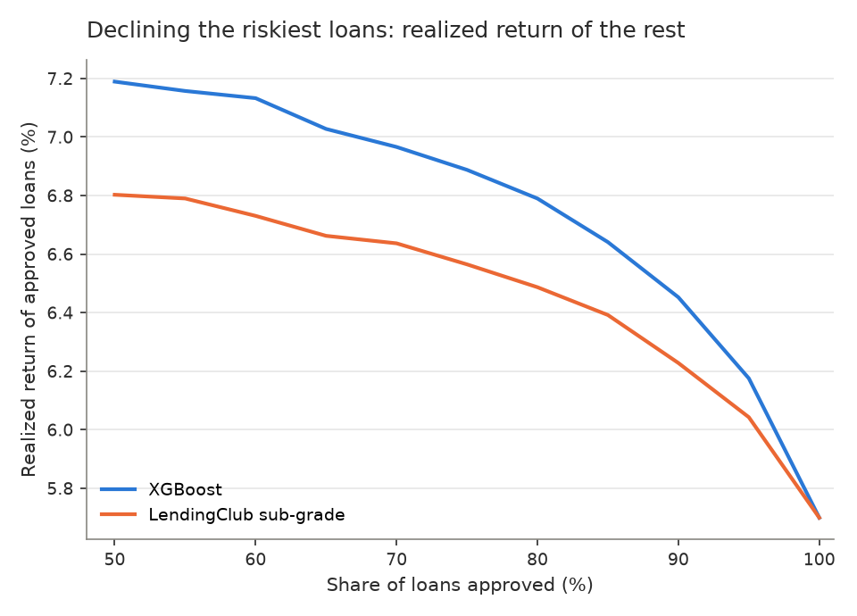
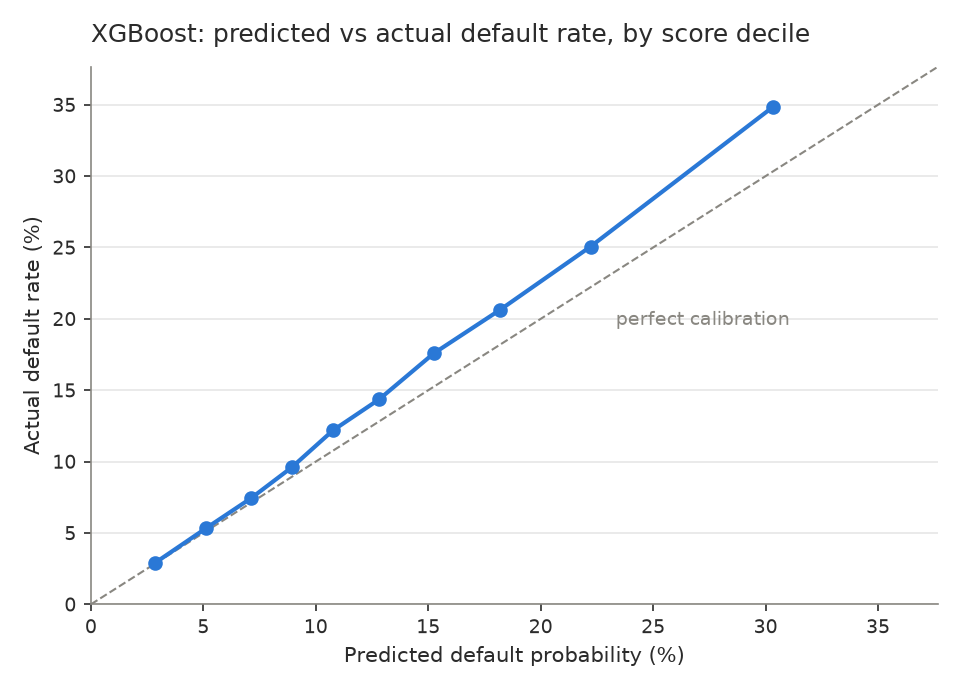
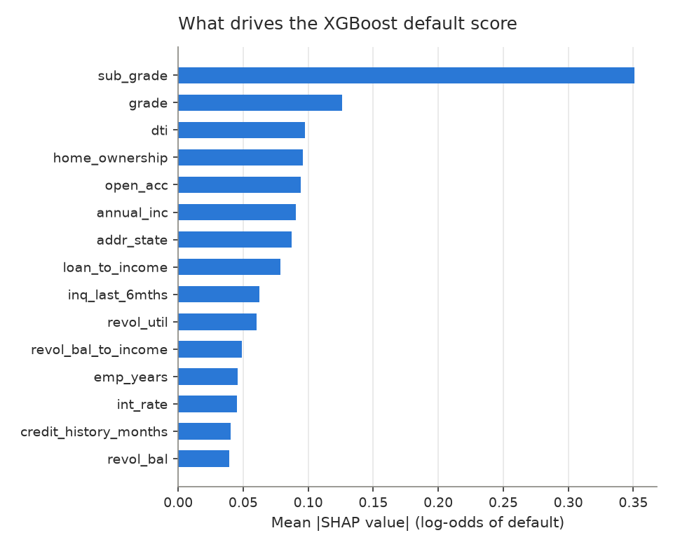

# Predicting loan defaults on LendingClub, without leakage

[](https://github.com/Arocks1674/Credit-Risk-Prediction-lendingclub/actions/workflows/tests.yml)

[](LICENSE)

A probability-of-default model for 729,475 LendingClub loans (2007–2016), tested **out of time**:
trained on loans issued before September 2015, scored on the 155,296 loans issued after.

**Results on the out-of-time test set**

- **XGBoost reaches ROC-AUC 0.706, against 0.685 for LendingClub's own sub-grade.** Train AUC is 0.717,
  so there is little overfitting.
- **Using it to decline the riskiest 20% of loans would have raised the realized return of the rest
  from 5.7% to 6.8%,** against 6.5% when declining by LendingClub's grade. The default rate falls from 15.0% to 11.3%.
- **A neural network (PyTorch MLP) ties XGBoost** (0.706). On tabular data, gradient boosting does as well with less tuning.
- **SMOTE and class weights did not help.** Neither improved ranking, and both pushed the average predicted
  default risk to 42–43% when the true rate is 15%, which would wreck loan pricing.



## The three decisions that matter more than the model

| Decision | Why | Effect here |
|---|---|---|
| **Only loans that reached maturity** | A loan issued shortly before the data snapshot has had no time to default. Keeping only *finished* loans from recent years is worse: the ones that finished early are mostly defaults. | Default rate 20.1% on all finished loans vs **15.0%** on matured loans |
| **Only features known at approval** | Payments received, recoveries and last payment date describe the outcome. An allow-list of application fields is used, and a test checks no post-issue column gets in. | No fully paid loan has `recoveries > 0`, so a leaky model looks excellent and is useless at approval time |
| **Out-of-time test** | A random split lets the model learn from loans issued after the ones it is tested on. A lender never can. | Train before Sep 2015, test Sep 2015 – Feb 2016 |

Funnel ([`reports/data_summary.md`](reports/data_summary.md)): 2,260,668 rows → 1,303,638 with a final outcome →
**729,475 matured loans**. Only 0.6% of matured loans were still unfinished, so dropping them barely biases the sample.

## Models

All tuning uses a validation set made of the newest 20% of *training* loans; the test set is touched once.

| Model (out-of-time test) | ROC-AUC | Train AUC | KS | PR-AUC | Brier | Mean predicted PD |
|---|---|---|---|---|---|---|
| LendingClub sub-grade only | 0.685 | 0.667 | 0.271 | 0.262 | 0.1209 | 13.3% |
| Logistic regression | 0.699 | 0.689 | 0.294 | 0.278 | 0.1197 | 13.4% |
| **XGBoost** (depth 5, 443 trees) | **0.706** | 0.717 | **0.301** | **0.290** | 0.1188 | 13.4% |
| **MLP / ANN** (128-64, dropout, 9 epochs) | **0.706** | 0.700 | 0.299 | 0.289 | **0.1186** | 14.3% |
| XGBoost **without** LC grade and rate | 0.692 | 0.708 | 0.278 | 0.279 | 0.1202 | 13.1% |

Actual test default rate: 15.0%. Full table: [`reports/model_comparison.md`](reports/model_comparison.md).

- **LendingClub's grade already captures most of the risk.** The model adds 0.021 AUC on top of it. Without
  the grade and interest rate, the applicant features alone (0.692) still rank risk better than the grade (0.685).
- **Class imbalance (15% defaults).** Same logistic model, same data:

  | Treatment | Training loans | ROC-AUC | Mean predicted PD |
  |---|---|---|---|
  | None | all 574k | 0.699 | 13.4% |
  | Class weights | all 574k | 0.699 | 43.4% |
  | None | 150k subset | 0.698 | 13.3% |
  | SMOTE | same 150k subset | 0.693 | 41.7% |

  Resampling changes the threshold, not the ranking. For a probability model, pick the cut-off from costs instead.

## Is the model trustworthy?

**Calibration.** Predicted and actual default rates track each other across deciles, and the riskiest 10% of
loans default 12 times as often as the safest 10% (34.9% vs 2.9%). The model **under-predicts by about 1.6
points** on this newest vintage (13.4% vs 15.0%): late-2015 loans defaulted more than earlier ones. Ranking holds
out of time; probability levels drift, so in production they would be recalibrated on recent loans.

 

**What drives the score (SHAP).** LendingClub's sub-grade dominates, followed by debt-to-income, home ownership,
number of open accounts, income and state. All of them are application-time fields.

## Run it

Data: LendingClub "loan.csv", 2007–2018 (Kaggle, *Lending Club Loan Data*), saved as `data/loan.csv`. It is not committed.

```bat
python -m venv .venv
.venv\Scripts\activate
pip install -r requirements.txt
python -m pytest -q             :: 11 tests, synthetic data, no download needed
python profile_data.py          :: data profile + 5% sample
python prepare_data.py          :: matured loans, features, split -> data/loans.parquet
python train_models.py          :: all models -> reports/model_comparison.md (~15 min on a laptop CPU)
python evaluate_models.py       :: calibration, approval policy, SHAP -> reports/
```

```
src/data/prepare.py        target, matured-loan filter, feature allow-list, out-of-time split
src/models/preprocess.py   quantile scaling + one-hot for linear/MLP; categories for XGBoost
src/models/mlp.py          PyTorch MLP with early stopping on validation AUC
src/models/metrics.py      ROC-AUC, Gini, KS, PR-AUC, Brier, log loss
```

## Limits

- **Realized return** counts everything received over each loan's life against the amount funded. It is not annualized and ignores funding costs and taxes.
- **LendingClub only approved some applicants.** The model has never seen rejected applications, so it can rank approved-type borrowers, not the whole population (reject inference is out of scope).
- The out-of-time test contains only 36-month loans: 60-month loans from late 2015 had not matured by the data snapshot (Feb 2019).
- Thresholds and costs here are illustrative; a real lender would set them from its funding cost and loss-given-default.

## License

[MIT](LICENSE)
